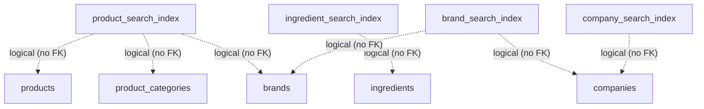

# Foundation Layer — Dependency Graph, Migration Graph, Build Order

## 1. Object dependency graph

Arrows mean "depends on" (a dependency must exist first).

```mermaid
graph TD
    EXT[Extensions<br/>pgcrypto · citext · pg_trgm]
    ENUM[Enums<br/>entity_status · approval_status · review_tier · review_decision<br/>version_status · confidence_band · translation_status<br/>candidate_status · update_type · unit_dimension]

    EXT --> ENUM

    LS[lifecycle_statuses]
    LANG[languages] --> LS
    COUNTRY[countries] --> LS
    UNITS[units] --> ENUM
    UNITS --> LS
    PKG[package_types] --> LS
    BC[barcode_types] --> LS
    IMG[image_types] --> LS
    RT[relationship_types] --> RT
    RT --> LS
    ST[source_types] --> LS
    SP[source_priorities] --> LS
    DS[data_sources] --> ST
    DS --> SP
    DS --> COUNTRY
    DS --> LS
    HFT[health_flag_types] --> LS

    RG[regions] --> LS
    IC[ingredient_categories] --> IC
    IC --> LS
    PC[product_categories] --> PC
    PC --> LS
    AT[allergen_types] --> LS
    NT[nutrition_types] --> LS
    RA[regulatory_authorities] --> LS
    ET[evidence_types] --> LS
    RT2[role_types] --> LS
    PT[permission_types] --> LS
    AET[audit_event_types] --> LS

    ENUM --> LANG
    ENUM --> COUNTRY
    ENUM --> PKG
    ENUM --> BC
    ENUM --> IMG
    ENUM --> ST
    ENUM --> SP
    ENUM --> DS

    ENUM --> RG
    ENUM --> IC
    ENUM --> PC
    ENUM --> AT
    ENUM --> NT
    ENUM --> RA
    ENUM --> ET
    ENUM --> RT2
    ENUM --> PT
    ENUM --> AET

    FUNC[set_updated_at()] --> LS
    FUNC --> LANG
    FUNC --> COUNTRY
    FUNC --> UNITS
    FUNC --> PKG
    FUNC --> BC
    FUNC --> IMG
    FUNC --> RT
    FUNC --> ST
    FUNC --> SP
    FUNC --> DS
    FUNC --> HFT
    FUNC --> RG
    FUNC --> IC
    FUNC --> PC
    FUNC --> AT
    FUNC --> NT
    FUNC --> RA
    FUNC --> ET
    FUNC --> RT2
    FUNC --> PT
    FUNC --> AET

    CO[companies] --> LS
    CO --> DS
    COTR[company_translations] --> CO
    COTR --> LANG
    BR[brands] --> CO
    BR --> LS
    BR --> DS
    BRTR[brand_translations] --> BR
    BRTR --> LANG
    PR[products] --> BR
    PR --> PC
    PR --> LS
    PR --> DS
    PRTR[product_translations] --> PR
    PRTR --> LANG
    IN[ingredients] --> LS
    IN --> DS
    INTR[ingredient_translations] --> IN
    INTR --> LANG
    AL[allergens] --> AT
    AL --> LS
    AL --> DS
    ALTR[allergen_translations] --> AL
    ALTR --> LANG
    NTT[nutrition_type_translations] --> NT
    NTT --> LANG
    PCT[product_category_translations] --> PC
    PCT --> LANG
    HF[health_flags] --> HFT
    HF --> LS
    HF --> DS
    HFTR[health_flag_translations] --> HF
    HFTR --> LANG

    FUNC --> CO
    FUNC --> COTR
    FUNC --> BR
    FUNC --> BRTR
    FUNC --> PR
    FUNC --> PRTR
    FUNC --> IN
    FUNC --> INTR
    FUNC --> AL
    FUNC --> ALTR
    FUNC --> NTT
    FUNC --> PCT
    FUNC --> HF
    FUNC --> HFTR

    PIG[product_ingredients] --> PR
    PIG --> IN
    PIG --> RT
    PIG --> DS
    PIG --> ET
    PIG --> UNITS
    PIG --> LS
    PAL[product_allergens] --> PR
    PAL --> AL
    PAL --> RT
    PAL --> DS
    PAL --> ET
    PAL --> LS
    PNV[product_nutrition_values] --> PR
    PNV --> NT
    PNV --> UNITS
    PNV --> RT
    PNV --> DS
    PNV --> ET
    PNV --> LS
    PHF[product_health_flags] --> PR
    PHF --> HF
    PHF --> RT
    PHF --> DS
    PHF --> ET
    PHF --> LS
    IAL[ingredient_allergens] --> IN
    IAL --> AL
    IAL --> RT
    IAL --> DS
    IAL --> ET
    IAL --> LS
    IHF[ingredient_health_flags] --> IN
    IHF --> HF
    IHF --> RT
    IHF --> DS
    IHF --> ET
    IHF --> LS
    IALI[ingredient_aliases] --> IN
    IALI --> LANG
    IALI --> RT
    IALI --> DS
    IALI --> ET
    IALI --> LS
    ER[entity_relationships] --> RT
    ER --> DS
    ER --> ET
    ER --> LS

    FUNC --> PIG
    FUNC --> PAL
    FUNC --> PNV
    FUNC --> PHF
    FUNC --> IAL
    FUNC --> IHF
    FUNC --> IALI
    FUNC --> ER

    MB[measurement_bases] --> LS
    MB --> FUNC
    PNV --> MB

    PIM[product_images] --> PR
    PIM --> IMG
    PIM --> RT
    PIM --> DS
    PIM --> ET
    PIM --> LS
    PBC[product_barcodes] --> PR
    PBC --> BC
    PBC --> RT
    PBC --> DS
    PBC --> ET
    PBC --> LS
    FUNC --> MB
    FUNC --> PIM
    FUNC --> PBC
    PIMH[product_images_history] --> PIM
    PIMH --> IMG
    PIMH --> PR
    PIMH --> RT
    PIMH --> DS
    PIMH --> ET
    PIMH --> LS
    PIMH --> CS
    PIMH --> PIMH
    PBCH[product_barcodes_history] --> PBC
    PBCH --> BC
    PBCH --> PR
    PBCH --> RT
    PBCH --> DS
    PBCH --> ET
    PBCH --> LS
    PBCH --> CS
    PBCH --> PBCH
    GUARD2 --> PIMH
    GUARD2 --> PBCH
    CAP[capture_entity_history()] --> CO
    CAP --> BR
    CAP --> PR
    CAP --> IN
    CAP --> AL
    CAP --> HF
    CAP --> NT
    CAP --> PC
    CAP --> IC
    CAP --> IMG
    CAP --> BC
    CAP --> PIM
    CAP --> PBC
    VAL[validate_entity_relationship_endpoints()] --> ER
    TRIGER2[entity_relationships_validate_endpoints] --> VAL

    VS[verification_statuses] --> LS
    VS --> FUNC
    IMG[images] --> IT
    IMG --> DS
    IMG --> LANG
    IMG --> LS
    IMG --> FUNC
    BC[barcodes] --> BT
    BC --> VS
    BC --> DS
    BC --> LS
    BC --> COUNTRY
    BC --> FUNC
    IMGH[images_history] --> IMG
    IMGH --> IT
    IMGH --> LANG
    IMGH --> DS
    IMGH --> LS
    IMGH --> CS
    IMGH --> IMGH
    BCH[barcodes_history] --> BC
    BCH --> BT
    BCH --> VS
    BCH --> COUNTRY
    BCH --> DS
    BCH --> LS
    BCH --> CS
    BCH --> BCH
    GUARD2[prevent_history_mutation()] --> IMGH
    GUARD2 --> BCH

    PSI[product_search_index]
    ISI[ingredient_search_index]
    BSI[brand_search_index]
    CSI[company_search_index]
    PSI -. "derived from (no FK)" .-> PR
    PSI -. "derived from (no FK)" .-> PC
    PSI -. "derived from (no FK)" .-> BR
    ISI -. "derived from (no FK)" .-> IN
    BSI -. "derived from (no FK)" .-> BR
    BSI -. "derived from (no FK)" .-> CO
    CSI -. "derived from (no FK)" .-> CO
```

Legend:

- `relationship_types`, `ingredient_categories`, and `product_categories`
  self-loops = their self foreign keys (`inverse_type_id`, `parent_id`).
- Triggers in `07-triggers` depend on `set_updated_at()` and on every table.
- No cycles exist between tables; the only self-references are
  `relationship_types.inverse_type_id`, `ingredient_categories.parent_id`, and
  `product_categories.parent_id`, each validated to differ from `id`.
- `companies → brands → products` is the ownership chain; translation tables
  depend on their base entity and `languages`.
- Mission 04 relationship tables depend on their endpoint entities and on the
  governed vocabulary (`relationship_types`, `data_sources`, `evidence_types`,
  `units`, `lifecycle_statuses`); no relationship table depends on another.
- `entity_relationships` is the polymorphic knowledge-graph edge table: its
  endpoints (`subject_id`/`object_id` + entity-type discriminators) reference
  core entities without a foreign key.
- Dashed edges (`product_search_index`, `ingredient_search_index`,
  `brand_search_index`, `company_search_index`) are **logical derivation, not
  foreign keys** (Mission 08): the search read models are derived from canonical
  entities and are fully rebuildable. They carry no FK dependencies at all.
- **ECR-001 additions:** `measurement_bases` is a governed lookup (Blocker 4);
  `product_images` and `product_barcodes` are Mission 04-style relationship
  tables (Blocker 1) with full immutable history (`product_images_history`,
  `product_barcodes_history`). `capture_entity_history()` automatically records
  a snapshot on INSERT/UPDATE of every history-owning table (Blocker 3) and
  `validate_entity_relationship_endpoints()` makes `entity_relationships`
  reject edges whose endpoints do not exist (Blocker 2). All of these are
  additive: nothing existing was modified, renamed, or removed.

### Foreign-key summary

| Referencing column          | Referenced table      | Applied in |
| --------------------------- | --------------------- | ---------- |
| `relationship_types.inverse_type_id` | `relationship_types.id` | 0004 |
| `data_sources.source_type_id`        | `source_types.id`     | 0004 |
| `data_sources.priority_id`           | `source_priorities.id` | 0004 |
| `data_sources.country_id`            | `countries.id`        | 0004 |
| `*.<lookup>.status_id` (all 11 lookup tables) | `lifecycle_statuses.id` | 0004 |
| `ingredient_categories.parent_id`    | `ingredient_categories.id` | 0009 |
| `product_categories.parent_id`       | `product_categories.id` | 0009 |
| `*.<reference>.status_id` (10 Mission 02 tables) | `lifecycle_statuses.id` | 0009 |
| `brands.company_id`                  | `companies.id`        | 0013 |
| `products.brand_id`                  | `brands.id`           | 0013 |
| `products.product_category_id`       | `product_categories.id` | 0013 |
| `allergens.allergen_type_id`         | `allergen_types.id`   | 0013 |
| `health_flags.health_flag_type_id`   | `health_flag_types.id` | 0013 |
| `*.<core>.status_id` (6 core entities) | `lifecycle_statuses.id` | 0013 |
| `*.<core>.source_id` (6 core entities) | `data_sources.id`     | 0013 |
| `*.<translation>.{entity}_id` (8 tables) | the owning entity    | 0013 |
| `*.<translation>.language_id` (8 tables) | `languages.id`       | 0013 |
| `product_ingredients.{product,ingredient,relationship_type,source,evidence_type,unit,status}_id` | `products`/`ingredients`/`relationship_types`/`data_sources`/`evidence_types`/`units`/`lifecycle_statuses` | 0017 |
| `product_allergens.{product,allergen,relationship_type,source,evidence_type,status}_id` | `products`/`allergens`/`relationship_types`/`data_sources`/`evidence_types`/`lifecycle_statuses` | 0017 |
| `product_nutrition_values.{product,nutrition_type,unit,relationship_type,source,evidence_type,status}_id` | `products`/`nutrition_types`/`units`/`relationship_types`/`data_sources`/`evidence_types`/`lifecycle_statuses` | 0017 |
| `product_health_flags.{product,health_flag,relationship_type,source,evidence_type,status}_id` | `products`/`health_flags`/`relationship_types`/`data_sources`/`evidence_types`/`lifecycle_statuses` | 0017 |
| `ingredient_allergens.{ingredient,allergen,relationship_type,source,evidence_type,status}_id` | `ingredients`/`allergens`/`relationship_types`/`data_sources`/`evidence_types`/`lifecycle_statuses` | 0017 |
| `ingredient_health_flags.{ingredient,health_flag,relationship_type,source,evidence_type,status}_id` | `ingredients`/`health_flags`/`relationship_types`/`data_sources`/`evidence_types`/`lifecycle_statuses` | 0017 |
| `ingredient_aliases.{ingredient,language,relationship_type,source,evidence_type,status}_id` | `ingredients`/`languages`/`relationship_types`/`data_sources`/`evidence_types`/`lifecycle_statuses` | 0017 |
| `entity_relationships.{relationship_type,source,evidence_type,status}_id` | `relationship_types`/`data_sources`/`evidence_types`/`lifecycle_statuses` | 0017 |
| `*_history.original_entity_id` (9 history tables) | the owning canonical entity (companies/brands/products/ingredients/allergens/health_flags/nutrition_types/categories) | 0022 |
| `*_history.previous_version_id` (9 history tables) | the owning history table (self) | 0022 |
| `*_history.source_id` (9 history tables) | `data_sources.id` | 0022 |
| `*_history.status_id` (9 history tables) | `lifecycle_statuses.id` | 0022 |
| `*_history.change_set_id` (9 history tables) | `change_sets.id` | 0022 |
| `brands_history.company_id` | `companies.id` | 0022 |
| `products_history.{brand_id,product_category_id}` | `brands.id`/`product_categories.id` | 0022 |
| `allergens_history.allergen_type_id` | `allergen_types.id` | 0022 |
| `health_flags_history.health_flag_type_id` | `health_flag_types.id` | 0022 |
| `product_categories_history.parent_id` / `ingredient_categories_history.parent_id` | the owning category table | 0022 |
| `audit_context.role_id` | `role_types.id` | 0022 |
| `change_sets.(correlation_id, transaction_id)` | `audit_context.(correlation_id, transaction_id)` (composite) | 0022 |
| `audit_log.{change_set_id,event_type_id,role_id}` | `change_sets`/`audit_event_types`/`role_types` | 0022 |
| `audit_events.{audit_log_id,event_type_id}` | `audit_log`/`audit_event_types` | 0022 |
| `entity_versions.{change_set_id,previous_version_id}` | `change_sets`/`entity_versions` (self) | 0022 |
| `version_metadata.entity_version_id` | `entity_versions.id` | 0022 |
| `verification_statuses.status_id` | `lifecycle_statuses.id` | 0027 |
| `images.{image_type_id,source_id,language_id,status_id}` | `image_types`/`data_sources`/`languages`/`lifecycle_statuses` | 0027 |
| `barcodes.{barcode_type_id,verification_status_id,source_id,status_id,issued_country_id}` | `barcode_types`/`verification_statuses`/`data_sources`/`lifecycle_statuses`/`countries` | 0027 |
| `images_history.{original_entity_id,previous_version_id,change_set_id,source_id,status_id,image_type_id,language_id}` | `images`/`images_history`(self)/`change_sets`/`data_sources`/`lifecycle_statuses`/`image_types`/`languages` | 0027 |
| `barcodes_history.{original_entity_id,previous_version_id,change_set_id,source_id,status_id,barcode_type_id,verification_status_id,issued_country_id}` | `barcodes`/`barcodes_history`(self)/`change_sets`/`data_sources`/`lifecycle_statuses`/`barcode_types`/`verification_statuses`/`countries` | 0027 |
| `measurement_bases.status_id` | `lifecycle_statuses.id` | 0034 |
| `product_nutrition_values.measurement_basis_id` | `measurement_bases.id` | 0034 |
| `product_images.{product,image,relationship_type,source,evidence_type,status}_id` | `products`/`images`/`relationship_types`/`data_sources`/`evidence_types`/`lifecycle_statuses` | 0034 |
| `product_barcodes.{product,barcode,relationship_type,source,evidence_type,status}_id` | `products`/`barcodes`/`relationship_types`/`data_sources`/`evidence_types`/`lifecycle_statuses` | 0034 |
| `product_images_history.{original_entity_id,previous_version_id,change_set_id,product_id,image_id,relationship_type_id,source_id,evidence_type_id,status_id}` | `product_images`/`product_images_history`(self)/`change_sets`/`products`/`images`/`relationship_types`/`data_sources`/`evidence_types`/`lifecycle_statuses` | 0034 |
| `product_barcodes_history.{original_entity_id,previous_version_id,change_set_id,product_id,barcode_id,relationship_type_id,source_id,evidence_type_id,status_id}` | `product_barcodes`/`product_barcodes_history`(self)/`change_sets`/`products`/`barcodes`/`relationship_types`/`data_sources`/`evidence_types`/`lifecycle_statuses` | 0034 |

All foreign keys use `ON DELETE RESTRICT` / `ON UPDATE RESTRICT` (`ADR-006`,
`ADR-008`). `entity_relationships.subject_id` / `object_id` are polymorphic
endpoints with no FK (see `docs/mission04_report.md`, assumptions); since ECR-001
their existence is still guaranteed at the storage layer by the
`validate_entity_relationship_endpoints()` trigger (Blocker 2). The same
no-FK polymorphism applies to `entity_versions.{history_table,history_row_id}`
and the audit `entity_type`/`entity_id` discriminators (see
`docs/mission05_report.md`, assumptions). The Mission 08 search tables
(`product_search_index`, `ingredient_search_index`, `brand_search_index`,
`company_search_index`) have **no foreign keys at all** — their `{entity}_id`
columns are logical references only (derived read models; see
`docs/mission08_report.md`).

### Mission 05 history/audit dependencies

```mermaid
graph TD
    AC[audit_context] --> RT[role_types]
    CS[change_sets] --> AC
    ALOG[audit_log] --> CS
    ALOG --> AET[audit_event_types]
    ALOG --> RT
    AEV[audit_events] --> ALOG
    AEV --> AET
    EV[entity_versions] --> CS
    EV --> EV
    VM[version_metadata] --> EV
    COH[companies_history] --> CO[companies]
    COH --> DS[data_sources]
    COH --> LS[lifecycle_statuses]
    COH --> CS
    COH --> COH
    BRH[brands_history] --> BR[brands]
    BRH --> CO
    BRH --> DS
    BRH --> LS
    BRH --> CS
    PRH[products_history] --> PR[products]
    PRH --> BR
    PRH --> PC[product_categories]
    PRH --> DS
    PRH --> LS
    PRH --> CS
    INH[ingredients_history] --> IN[ingredients]
    INH --> DS
    INH --> LS
    INH --> CS
    ALH[allergens_history] --> AL[allergens]
    ALH --> AT[allergen_types]
    ALH --> DS
    ALH --> LS
    ALH --> CS
    HFH[health_flags_history] --> HF[health_flags]
    HFH --> HFT[health_flag_types]
    HFH --> DS
    HFH --> LS
    HFH --> CS
    NTH[nutrition_types_history] --> NT[nutrition_types]
    NTH --> DS
    NTH --> LS
    NTH --> CS
    PCH[product_categories_history] --> PC
    PCH --> DS
    PCH --> LS
    PCH --> CS
    ICH[ingredient_categories_history] --> IC[ingredient_categories]
    ICH --> DS
    ICH --> LS
    ICH --> CS
    GUARD[prevent_history_mutation()] --> COH
    GUARD --> BRH
    GUARD --> PRH
    GUARD --> INH
    GUARD --> ALH
    GUARD --> HFH
    GUARD --> NTH
    GUARD --> PCH
    GUARD --> ICH
```

- History tables depend on their canonical entity, `data_sources`,
  `lifecycle_statuses`, and `change_sets`, plus their own self-reference
  (`previous_version_id`). They are INSERT-only (guarded by
  `prevent_history_mutation()`); no other table depends on a history table.
- Audit tables form a strict chain `audit_context → change_sets → audit_log →
  audit_events` and the parallel registry `entity_versions → version_metadata`;
  no cycles.

### Mission 07 media/barcode dependencies

```mermaid
graph TD
    VS[verification_statuses] --> LS[lifecycle_statuses]
    IMG[images] --> IT[image_types]
    IMG --> DS[data_sources]
    IMG --> LANG[languages]
    IMG --> LS
    BC[barcodes] --> BT[barcode_types]
    BC --> VS
    BC --> DS
    BC --> LS
    BC --> COUNTRY[countries]
    IMGH[images_history] --> IMG
    IMGH --> IT
    IMGH --> LANG
    IMGH --> DS
    IMGH --> LS
    IMGH --> CS[change_sets]
    IMGH --> IMGH
    BCH[barcodes_history] --> BC
    BCH --> BT
    BCH --> VS
    BCH --> COUNTRY
    BCH --> DS
    BCH --> LS
    BCH --> CS
    BCH --> BCH
    GUARD[prevent_history_mutation()] --> IMGH
    GUARD --> BCH
```

- `verification_statuses` is a Mission 07 lookup vocabulary (governed, not an
  ENUM, `ADR-007`/`ADR-008`) referenced only by `barcodes` and
  `barcodes_history`.
- `images` and `barcodes` are canonical entities (Mission 07); their history
  tables follow the Mission 05 architecture and are INSERT-only. No cycles; the
  only new self-references are `images_history.previous_version_id` and
  `barcodes_history.previous_version_id`.

### Mission 08 search-layer dependencies



- The four search tables are **derived read models** (Mission 08): they carry
  `product_id` / `ingredient_id` / `brand_id` / `company_id` as **logical
  references with no foreign key** — the whole layer is disposable and
  rebuildable from canonical data.
- No search table is an FK target, no search table has a trigger, and no search
  table references another table through a constraint. They are isolated by
  design.

## 2. Migration graph

Migrations are applied strictly in ascending numeric order; each is atomic
(`--single-transaction`) and recorded in the `schema_migrations` ledger with an
MD5 checksum (`scripts/migrate.ps1`).


| Migration | Contents (schema sources) | Why this order |
| --------- | ------------------------- | -------------- |
| `0001_foundation_extensions` | `00-extensions/01_extensions.sql` | Extensions must exist before any table uses `citext`. |
| `0002_foundation_enums` | all `01-enums/*.sql` | Enum types must exist before any column references them. No dependencies among enums. |
| `0003_foundation_lookup_tables` | all `02-tables/01_*.sql`…`12_*.sql` (12 tables) | All tables carry enum-typed or citext columns; no table depends on another at creation (FKs are deferred). |
| `0004_foundation_lookup_constraints` | `03-constraints/01…03` | FK targets and the self-referencing table all exist by now; cross-table integrity is added last. |
| `0005_foundation_lookup_indexes` | `04-indexes/01…04` | Indexes, including the FK-supporting and partial-unique ones, run after tables and constraints. |
| `0006_foundation_functions_and_triggers` | `06-functions/*.sql`, `07-triggers/01` | Function before its triggers; triggers after all tables exist. |
| `0007_seed_lifecycle_statuses` | `seed/00-system/01_lifecycle_statuses.sql` | `status_id` is NOT NULL, so the lifecycle vocabulary must exist before any governed insert. |
| `0008_foundation_reference_tables` | `02-tables/13_*.sql`…`22_*.sql` (10 tables, Mission 02) | Same rule as 0003: citext/enum prerequisites exist; FKs deferred. |
| `0009_foundation_reference_constraints` | `03-constraints/04_mission02_fks.sql` | status_id → `lifecycle_statuses` (0003) and parent self-REFs (0008) both exist. |
| `0010_foundation_reference_indexes` | `04-indexes/05_mission02.sql` | Indexes run after the tables and constraints they support. |
| `0011_foundation_reference_triggers` | `07-triggers/02_mission02_tables_updated_at.sql` | `set_updated_at()` (0006) and the 10 reference tables (0008) exist. |
| `0012_core_entity_tables` | `02-tables/23_*.sql`…`36_*.sql` (14 tables, Mission 03) | Same rule as 0003/0008: citext/enum/lookup prerequisites exist; FKs deferred. |
| `0013_core_entity_constraints` | `03-constraints/05_core_entities.sql` | All FK targets (lookups + core entities) exist; cross-table integrity added last. |
| `0014_core_entity_indexes` | `04-indexes/06_core_entities.sql` | FK-supporting indexes run after tables and constraints. |
| `0015_core_entity_triggers` | `07-triggers/03_core_entities_updated_at.sql` | `set_updated_at()` (0006) and the 14 core tables (0012) exist. |
| `0016_relationship_tables` | `02-tables/37_*.sql`…`44_*.sql` (8 tables, Mission 04) | Endpoint entities (0012) and vocabulary (0003/0008) exist; FKs deferred. |
| `0017_relationship_constraints` | `03-constraints/06_relationships.sql` | All FK targets (endpoints + vocabulary) exist; cross-table integrity added last. |
| `0018_relationship_indexes` | `04-indexes/07_relationships.sql` | FK-supporting indexes run after tables and constraints. |
| `0019_relationship_triggers` | `07-triggers/04_relationships_updated_at.sql` | `set_updated_at()` (0006) and the 8 relationship tables (0016) exist. |
| `0020_history_tables` | `02-tables/45_*.sql`…`53_*.sql` (9 history tables, Mission 05) | Snapshot sources (0012), `data_sources` (0008), `lifecycle_statuses` (0003), and `change_sets` (0021) exist; FKs deferred. |
| `0021_audit_tables` | `02-tables/54_*.sql`…`59_*.sql` (6 audit tables, Mission 05) | `role_types` (0008) and `audit_event_types` (0008) exist; FKs deferred. |
| `0022_history_constraints` | `03-constraints/07_history_and_audit.sql` | All FK targets — canonical entities, vocabulary, history tables, audit tables — exist; cross-table integrity added last. |
| `0023_history_indexes` | `04-indexes/08_history_and_audit.sql` | FK-supporting indexes run after tables and constraints. |
| `0024_history_triggers` | `06-functions/02_prevent_history_mutation.sql`, `07-triggers/05` and `06` | Guard function before its triggers; triggers after all tables exist. |
| `0025_media_and_barcode_tables` | `02-tables/60_*.sql`…`62_*.sql` (3 tables, Mission 07) | Vocabulary (`image_types`, `barcode_types`, `data_sources`, `languages`, `countries`, `lifecycle_statuses`) exists; FKs deferred. |
| `0026_media_and_barcode_history_tables` | `02-tables/63_*.sql` and `64_*.sql` (2 history tables, Mission 07) | Snapshot sources (0025), `change_sets` (0021), vocabulary exist; FKs deferred. |
| `0027_media_and_barcode_constraints` | `03-constraints/08_media_and_barcodes.sql` | All FK targets — canonical media/barcode entities, history tables, vocabulary, `change_sets` — exist; cross-table integrity added last. |
| `0028_media_and_barcode_indexes` | `04-indexes/09_media_and_barcodes.sql` | FK-supporting indexes run after tables and constraints. |
| `0029_media_and_barcode_triggers` | `07-triggers/07` and `08` | `set_updated_at()` (0006) and `prevent_history_mutation()` (0024) exist; triggers after all tables exist. |
| `0030_search_tables` | `02-tables/65_*.sql`…`68_*.sql` (4 search tables, Mission 08) | Derived read models: `pg_trgm`/`citext` (0001) exist; logical references only — no FK targets required, FKs intentionally absent. |
| `0031_search_indexes` | `04-indexes/10_search_indexes.sql` | Search-only indexes (`pg_trgm` GIN, token GIN, rank btree) run after the tables exist. |
| `0032_ecr_product_media_tables` | `02-tables/69_*.sql`…`71_*.sql` (3 tables, ECR-001) | `measurement_bases` (lookup), `product_images` and `product_barcodes` (relationship tables). Endpoint entities (`products`, `images`, `barcodes` from 0012/0025) and vocabulary exist; FKs deferred. |
| `0033_ecr_product_media_history_tables` | `02-tables/72_*.sql` and `73_*.sql` (2 history tables, ECR-001) | Snapshot sources (0032), `change_sets` (0021), vocabulary exist; FKs deferred. |
| `0034_ecr_constraints` | `03-constraints/09` and `10` | All FK targets — relationship tables, history tables, endpoints, vocabulary — exist; the Blocker 4 natural-key extension (drop/re-add of `product_nutrition_values_fact_unique` with `measurement_basis_id`) runs here, after all tables exist. |
| `0035_ecr_indexes` | `04-indexes/11` and `12` | FK-supporting indexes for every new FK column run after tables and constraints. |
| `0036_ecr_functions` | `06-functions/03` and `04` | `capture_entity_history()` (Blocker 3) and `validate_entity_relationship_endpoints()` (Blocker 2) before their triggers; they depend on tables from 0003/0012/0025/0032 only at runtime. |
| `0037_ecr_triggers` | `07-triggers/09`…`12` | Capture triggers (13), the endpoint-validation trigger, `set_updated_at()` for the 3 new audit-trio tables, and immutability triggers for the 2 new history tables. Functions (0006/0036) and all tables exist. |

## 3. Build order (reproduce-from-source)

The migration files are generated, never hand-edited (`ADR-004`):

1. `powershell -File scripts/build_migrations.ps1` — regenerates `migrations/NNNN_*.sql` from `schema/`.
2. Review the migration diff, then commit.
3. Deploy to a target database:

   ```powershell
   psql -v db_name=fateen -v db_owner=fateen_app -f scripts/create_database.sql postgres
   powershell -File scripts/migrate.ps1 -Database fateen
   ```

## 4. Future milestone attachment points

These tables/types are the extension points for later work orders — the
Foundation Layer provides them so later milestones reference, never redesign:

| Future milestone            | Provided by foundation                              |
| --------------------------- | --------------------------------------------------- |
| Core catalog (built, Mission 03) | `companies`, `brands`, `products`, `ingredients`, `allergens`, `health_flags` + translations |
| Relationships (built, Mission 04) | `product_ingredients`, `product_allergens`, `product_nutrition_values`, `product_health_flags`, `ingredient_allergens`, `ingredient_health_flags`, `ingredient_aliases`, `entity_relationships` + `relationship_types` vocabulary |
| Product facts (nutrition/ingredients) | FK to `products`, `ingredients`, `nutrition_types`, `units`, `data_sources`; measurement basis via `measurement_bases` (**built, ECR-001**) |
| Images / barcodes           | **Built (Mission 07 + ECR-001):** `image_types`, `barcode_types`, `verification_statuses`, canonical `images`/`barcodes` + `images_history`/`barcodes_history`, and `product_images`/`product_barcodes` relationships + their history |
| Knowledge graph             | `entity_relationships` (Mission 04), `relationship_types` (directional + inverse), endpoint existence enforced by `validate_entity_relationship_endpoints()` (**built, ECR-001**) |
| Review / approval workflow  | `approval_status`, `review_tier`, `review_decision`, `role_types`, `permission_types` |
| Version history             | **Built (Mission 05):** `version_status`, `update_type`, 9 `*_history` tables, `entity_versions`, `version_metadata`, `change_sets` |
| Translations (i18n)         | `languages`, `translation_status`                   |
| Population pipeline         | `candidate_status`, `source_types`, `source_priorities`, `data_sources`, `pg_trgm`, `pgcrypto` |
| Search                       | **Built (Mission 08):** `product_search_index`, `ingredient_search_index`, `brand_search_index`, `company_search_index` + `pg_trgm` GIN indexes |
| Health / compliance         | `health_flag_types`, `allergen_types`, `regulatory_authorities`, `product_health_flags`, `ingredient_health_flags` |
| Nutrition                   | `nutrition_types`, `units`, `product_nutrition_values` |
| Evidence / provenance       | `evidence_types`, `data_sources`, `regulatory_authorities`, `confidence_band` |
| Auditing                    | **Built (Mission 05):** `audit_event_types`, `audit_context`, `change_sets`, `audit_log`, `audit_events` |
| Market scoping / expansion  | `regions`, `countries`                              |
| Confidence                  | `confidence_band` + numeric `confidence_score` on facts |

## 5. Mission 09 certification note + ECR-001

Mission 09 (Database Foundation Finalization) was **certification-only**: no
tables, constraints, indexes, triggers, or migrations were added, so the object
and migration graphs above are unchanged and are the certified truth. The
validator extended to 47 checks and passed **47/47**, including: every table in
exactly one category, every translation/history/search table resolving to an
existing base entity, every canonical entity having immutable history, every FK
target existing, every FK column indexed, and no circular dependencies. See
`docs/database_certification_report.md`.

**ECR-001 (Closing Five Certification Blockers)** then added migrations
`0032`–`0037` additively. The dependency and migration graphs above now reflect
the post-ECR-001 truth, and the validator extended to **55 checks** (ECR-001
block adds: product-media tables present, automatic history-capture trigger per
history-owning table, `capture_entity_history()` and
`validate_entity_relationship_endpoints()` functions, the endpoint-validation
trigger, `set_updated_at()` on the new audit-trio tables, the additive
`measurement_basis_id` extension, and migrations `0032`–`0037` present) and
passes **55/55**. No existing object, constraint, or migration was modified in
ECR-001 — every change is additive. See `docs/ecr001_report.md`.
